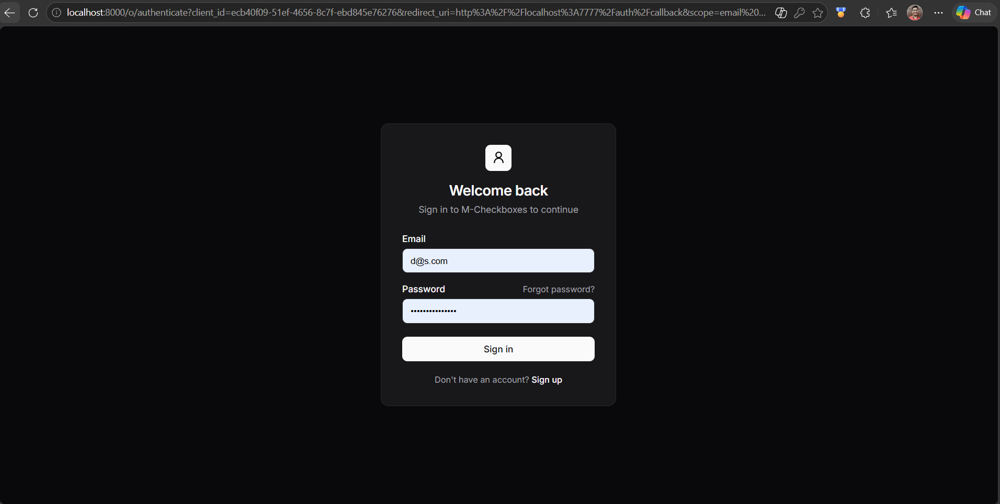
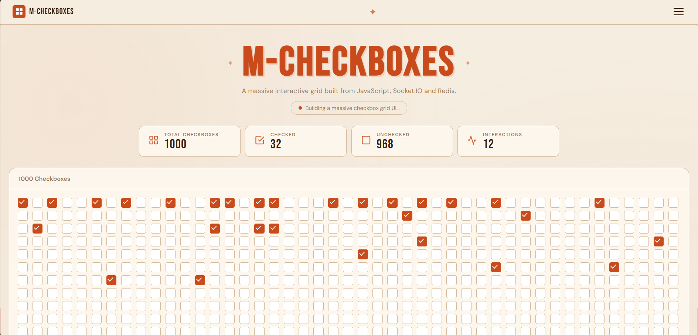
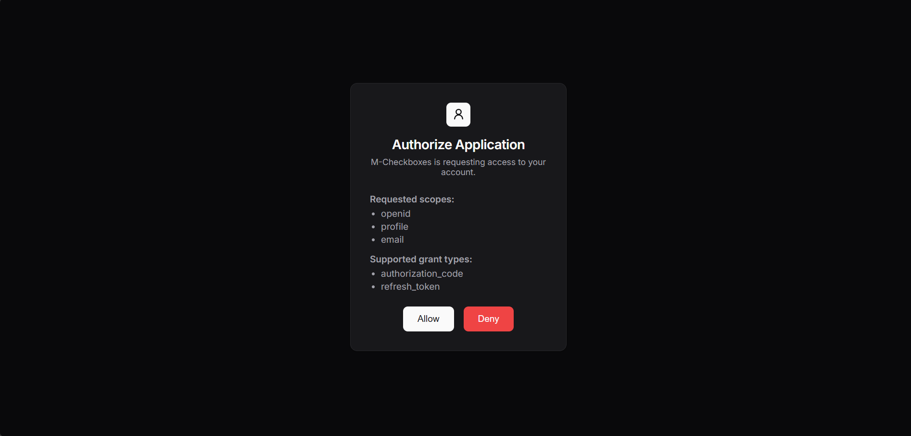
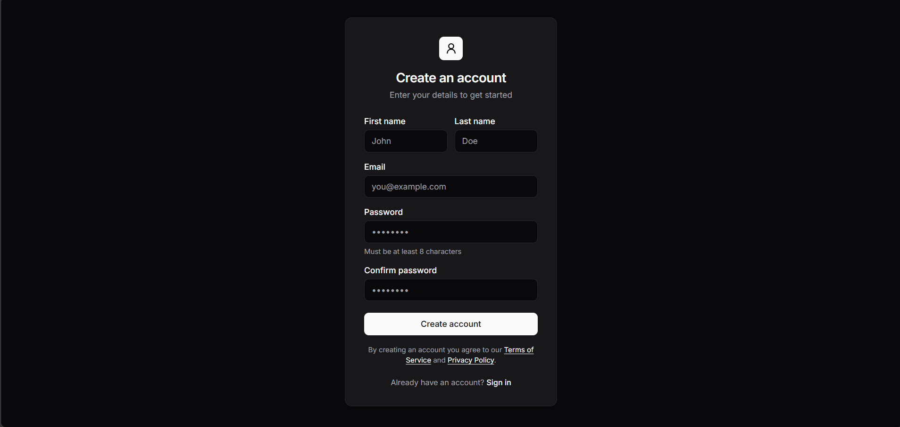

# Checkboxes

A real-time checkbox grid app built with Express, Socket.IO, Redis/Valkey, and OIDC authentication.

## Features

- Large checkbox grid rendered in the browser
- Real-time checkbox updates through Socket.IO
- Shared checkbox state stored in Redis/Valkey
- Manual socket rate limiting
- OIDC-based authentication and session handling

## Environment Variables Required

Create a `.env` file with these values:

- `PORT` - server port for the Express app
- `CLIENT_SERVER_PORT` - client/server port used in auth redirects
- `AUTH_SERVER_PORT` - OIDC auth server port
- `OIDC_CLIENT_ID` - OIDC client identifier
- `OIDC_CLIENT_SECRET` - OIDC client secret
- `SESSION_SECRET` - Express session secret
- `NODE_ENV` - optional, set to `production` when deploying

If `PORT` is not set, the app falls back to `CLIENT_SERVER_PORT`, then `7777`.

## Redis Setup Instructions

Redis/Valkey is required for:

- storing the shared checkbox state
- publishing checkbox changes to all connected clients
- storing the interaction count
- keeping per-socket rate limit metadata

### Local setup

1. Start the Redis container:

```bash
npm run db:up
```

2. Confirm Redis is running on `localhost:6379`.

3. Start the app:

```bash
npm run dev
```

The app uses the Redis connection defined in [redis-connection.js](redis-connection.js).

## Auth Flow Explanation

The app uses OIDC for login.

1. A user visits `/`.
2. If the session is missing, the app redirects to `/auth/login`.
3. The `/auth/login` route redirects the user to the OIDC provider.
4. After successful authentication, the provider redirects back to `/auth/callback`.
5. The callback exchanges the auth code for tokens and stores them in the session.
6. The user is redirected back to `/` and can access the protected app.
7. Logout destroys the session and clears the cookie.

Auth logic is split across:

- [src/modules/auth/auth.route.js](src/modules/auth/auth.route.js)
- [src/modules/auth/auth.controller.js](src/modules/auth/auth.controller.js)
- [src/modules/auth/auth.service.js](src/modules/auth/auth.service.js)
- [src/modules/auth/auth.middleware.js](src/modules/auth/auth.middleware.js)

## WebSocket Flow Explanation

1. The browser connects to Socket.IO after the page loads.
2. When a user toggles a checkbox, the client emits `client:checkbox:change`.
3. The server rate-limits the event per socket.
4. If allowed, the server updates the checkbox array in Redis.
5. The server increments the interactions counter in Redis.
6. The server publishes the update to Redis Pub/Sub.
7. The subscriber receives the event and broadcasts `server:checkbox:change` to all connected clients.
8. Every connected client updates the matching checkbox in real time.

The main flow lives in [index.js](index.js).

## Rate Limiting Logic Explanation

The app implements manual socket rate limiting without an external package.

- Each socket gets a Redis key like `rate-limit:<socket.id>`
- The server stores the timestamp of the last accepted checkbox action
- If a new event arrives too quickly, the server emits `server:error` and ignores the change
- This prevents event spam from a single socket connection

This is intentionally simple and easy to explain during evaluation.

## Screenshots / Demo

### Screenshots









### Demo Link & OIDC Server Repo Link

- YouTube: https://youtu.be/amAlJ_-ubJ8

- Repo: https://github.com/harshcsrivastava/oidc-oauth

## Project Structure

- [index.js](index.js) - app bootstrap, Socket.IO, Redis coordination, and main HTTP routes
- [redis-connection.js](redis-connection.js) - Redis client setup
- [src/modules/auth](src/modules/auth) - authentication logic
- [public](public) - frontend pages

## Notes

- The checkbox grid is fetched from `/checkbox` on page load.
- The app expects Redis/Valkey to be available before interacting with the grid.
- For production deployment, set `NODE_ENV=production` and use secure session settings appropriately.
